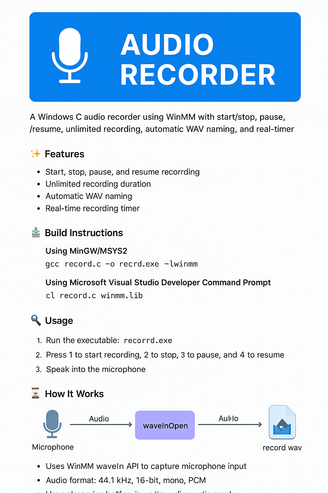

🎙️ Win32 Audio Recorder

  

 
  
   
   
   

A lightweight native Windows console audio recorder written in C using the WinMM (Windows Multimedia) API.
Supports Start / Stop / Pause / Resume, unlimited recording, automatic WAV naming, and live timer display.

✨ Features

🎚️ Start, Stop, Pause, and Resume recording

♾️ Unlimited recording duration (streams directly to disk)

💾 Auto-generated filenames (record_001.wav, record_002.wav, …)

⏱️ Real-time recording timer

🎤 Records from default Windows microphone

🔧 Uses only built-in Windows APIs (windows.h, mmsystem.h, winmm.lib)

📦 Outputs correct 16-bit PCM WAV files

🛠️ Build Instructions
🔵 Using MSYS2 MinGW64 (Recommended)

IMPORTANT: Run in MSYS2 MinGW 64-bit terminal, NOT PowerShell.

gcc record.c -o record.exe -lwinmm

🟣 Using Microsoft Visual C++ (Developer Command Prompt)
cl record.c winmm.lib

▶️ Usage

Run:

record.exe

Keyboard Controls:

Key	Action
1	Start recording
2	Stop and save WAV file
3	Pause recording
4	Resume recording
5	Exit program

Recordings appear as:

record_001.wav
record_002.wav
record_003.wav

🔧 Technical Overview

The program uses the WaveIn API inside WinMM to capture live microphone input.

Audio Format

PCM

44.1 kHz

16-bit

Mono

Main WinMM Functions

waveInOpen – open the input device

waveInPrepareHeader – prepare audio buffers

waveInAddBuffer – queue buffers for recording

waveInProc – callback when buffer fills

waveInStart – begin capture

waveInStop – stop capture

waveInClose – close device

WAV File Handling

Reserve 44 bytes for header

Stream raw PCM audio into the file

Fix header sizes after stopping

This allows unlimited-length recordings without high memory use.

🔊 Audio Pipeline Diagram
Microphone
    ↓
WinMM (waveInOpen)
    ↓
Audio Buffers (WAVEHDR)
    ↓
Callback (waveInProc)
    ↓
Write PCM to File
    ↓
After Stop → Fix WAV Header
    ↓
Your WAV File 🎧

📁 Project Structure
win32-audio-recorder/
│
├── record.c          # Main program
├── README.md         # This file
├── LICENSE           # MIT License
└── cover.png         # Banner image

🩹 Troubleshooting
❗ gcc: command not found

➡ You are in PowerShell.
Open MSYS2 MinGW 64-bit.

❗ undefined reference to waveInOpen

➡ You forgot this flag:

-lwinmm

❗ Keys don’t respond

➡ Click the console window to give it focus.

❗ No audio recorded

➡ Check Windows Settings → Privacy → Microphone → Allow apps to use microphone.

📜 License (MIT)
MIT License

Copyright (c) 2025 Salem

Permission is hereby granted, free of charge, to any person obtaining a copy
of this software and associated documentation files (the “Software”), to deal
in the Software without restriction, including without limitation the rights 
to use, copy, modify, merge, publish, distribute, sublicense, and/or sell 
copies of the Software, and to permit persons to whom the Software is 
furnished to do so, subject to the following conditions:

The above copyright notice and this permission notice shall be included in 
all copies or substantial portions of the Software.

THE SOFTWARE IS PROVIDED “AS IS”, WITHOUT WARRANTY OF ANY KIND, EXPRESS OR 
IMPLIED, INCLUDING BUT NOT LIMITED TO THE WARRANTIES OF MERCHANTABILITY, 
FITNESS FOR A PARTICULAR PURPOSE AND NONINFRINGEMENT. IN NO EVENT SHALL THE 
AUTHORS OR COPYRIGHT HOLDERS BE LIABLE FOR ANY CLAIM, DAMAGES OR OTHER 
LIABILITY, WHETHER IN AN ACTION OF CONTRACT, TORT OR OTHERWISE, ARISING FROM, 
OUT OF OR IN CONNECTION WITH THE SOFTWARE OR THE USE OR OTHER DEALINGS IN 
THE SOFTWARE.

🙏 Acknowledgments

Microsoft WinMM API

Win32 documentation & community examples

Audio DSP & WAV format documentation
